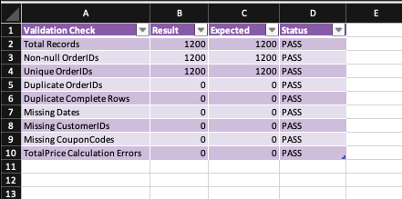
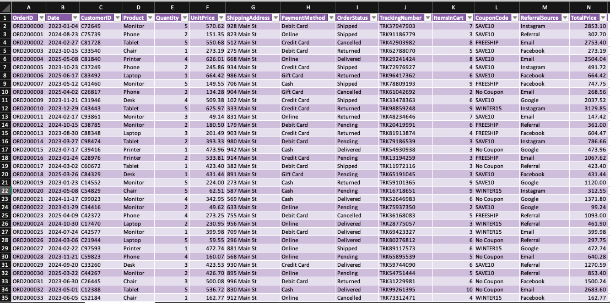

# Data Cleaning & Validation

### Week 1 Data Analytics Internship Project

A data cleaning, validation, and data quality verification project completed during the first week of my data analytics internship at Decode Labs.

## Project Overview

The objective of this project was to transform a raw dataset into a cleaner, more reliable dataset suitable for downstream analysis. The project focused not only on cleaning the data, but also on verifying that the cleaning process did not compromise data integrity.

## Objectives

- Identify and address data quality issues
- Standardize inconsistent data formats
- Check dataset completeness
- Verify record integrity
- Identify and assess duplicate records
- Validate the cleaned dataset
- Document changes made throughout the cleaning process

## Tools & Technologies

- Microsoft Excel
- Power Query
- Data Cleaning
- Data Validation
- Data Quality Assurance

## Workflow

The project followed a structured data preparation workflow:

Raw Data → Data Cleaning → Validation → Verification → Final Dataset

### 1. Raw Data

The original dataset was reviewed to identify potential quality and consistency issues before transformation.

### 2. Data Cleaning

The dataset was cleaned and standardized to improve consistency and prepare the data for analysis.

Key areas included:

- Data formatting and standardization
- Completeness checks
- Consistency checks
- Duplicate record assessment
- Data type verification

### 3. Validation

Validation checks were performed after cleaning to confirm that the resulting dataset maintained its structural and data integrity.

This included checking:

- Record completeness
- Identifier uniqueness
- Data consistency
- Required fields
- Final row integrity

### 4. Change Documentation

A change log was maintained to document the transformations performed during the cleaning process and provide traceability between the original and cleaned data.

## Validation Results

The cleaned dataset was subjected to a series of integrity and completeness checks to confirm that the cleaning process produced a reliable dataset.

Key validation outcomes included:

- Order IDs were checked for uniqueness, with no duplicate Order IDs identified.
- A complete-row check was performed to verify record-level completeness.
- Required fields were reviewed for completeness and consistency.
- Data formats and structures were verified following the cleaning process.
- A change log was maintained to document the transformations performed throughout the cleaning process.

These checks provided evidence that the cleaned dataset was structurally consistent and suitable for subsequent analysis.

## Project Preview

### Validation Summary

The validation stage was used to verify the integrity, completeness, and consistency of the cleaned dataset.



### Cleaned Dataset

The cleaned dataset represents the final output after applying the documented data cleaning and standardization steps.



## Project Workbook

The accompanying Excel workbook contains the project workflow and supporting documentation, including:

- RAW DATA — original dataset
- CLEANED DATA — processed dataset
- VALIDATION — data quality and integrity checks
- CHANGE LOG — documented cleaning and transformation activities

## Key Outcome

The final dataset was prepared for subsequent analytical work after completing data cleaning and validation checks.

The project reinforced the importance of treating data quality as a foundational stage of the analytics process rather than assuming that a dataset is analysis-ready.

## Key Learning

This project strengthened my understanding of the relationship between data cleaning and data validation.

Cleaning a dataset is only part of the process; validating the result is equally important to ensure that transformations have produced a reliable dataset without introducing new issues.

## Project Structure

```text
data-cleaning-and-validation/
│
├── Data Cleaning and Validation.xlsx
├── README.md
└── .gitattributes
